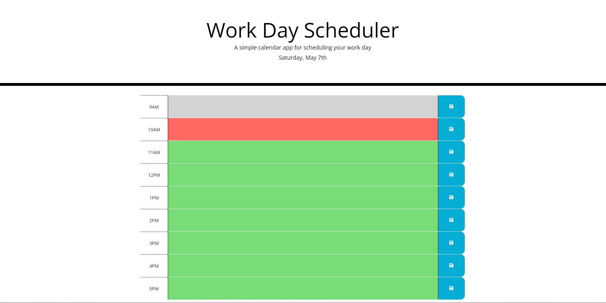

# Third-Party-API

[Deplyed Link](https://renbryant.github.io/Third-Party-API/)

GIVEN I am using a daily planner to create a schedule
WHEN I open the planner
THEN the current day is displayed at the top of the calendar
WHEN I scroll down
THEN I am presented with time blocks for standard business hours
WHEN I view the time blocks for that day
THEN each time block is color-coded to indicate whether it is in the past, present, or future
WHEN I click into a time block
THEN I can enter an event
WHEN I click the save button for that time block
THEN the text for that event is saved in local storage
WHEN I refresh the page
THEN the saved events persist

For this project, a calendar application is to be created for the user.

There are text boxes where the user can write in information for different time-blocks and a save button.

First I created a time block for each of the hours, which included a text area, a save button, and a column depicting the hour. Then I created a local storage get for each of the time blocks.

Then I created a function that color codes the time-blocks based on what time the machine that the user is on says it is. So that the past hours will be gray, the current hour is red, and the future hours are green. This was done using an if else, else statement.